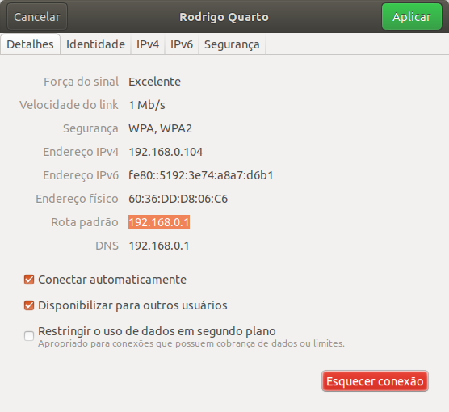
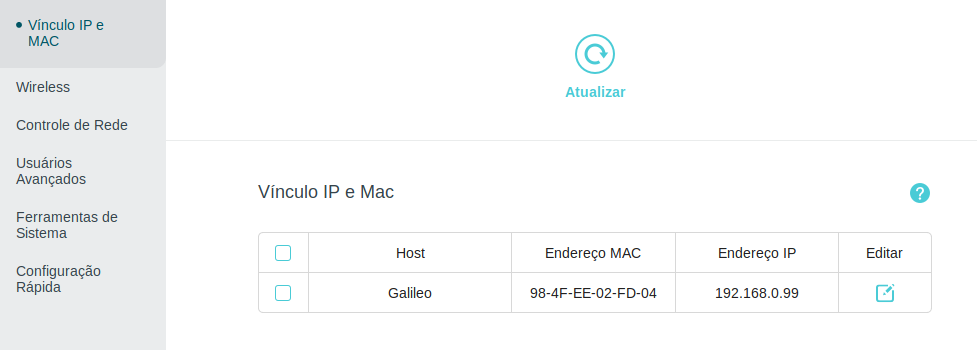

# Acessando a Galileo via SSH
Para acessar a Galileo em casa, é necessário configurar um IP para acessar a placa, visto que o roteador atribuí um IP para a placa e este número varia e não temos uma interface ou um visor que mostre o endereço correto no momento.

 1. Acesse o seu roteador pelo navegador da internet. Caso não saiba o IP do roteador acesse as configurações de rede.

 2. Após entrar na rede, procure por vincular um IP qualquer ao endereço MAC da placa. Você encontra o endereço MAC colado na entrada ethernet da Galileo.

 3. Após a configuração, de reset no roteador e acesse a placa desta maneira: 
`ssh <USER>@<IP_DEFINIDO>`

 
